# 《一封》 —— HTML5与移动互联网开发

Github：https://github.com/lemonoink/software-process-homework

## 项目简介

**一封**APP是一款致力于还原网络“纸媒”，支持便签化随手记的软件。在社会节奏越来越快，互联网时代实时通信越来越方便的趋势下，大众普遍失去大块时间进行更有仪式感的信件交流，但是仍有一部分社会群体无法彻底放弃写信的仪式感和真挚性，综合碎片化写文的需求以及用户对“信件往来”的期待，我们的“一封”APP适时而生。

## 项目成员

* 姜皓天
  * Github：https://github.com/lemonoink
* 李雪纯
  * Github：https://github.com/LIXUECHUN
* 赵一鸣
  * Github：https://github.com/Yzhaoyiming
* 马晓燕
  * Github：https://github.com/maxiaoyanD
* 曾雨晴
  * Github：https://github.com/zengyuqing0903
* 安文悦
  * Github：https://github.com/xiilienaya

## 原型设计

#### 私密写

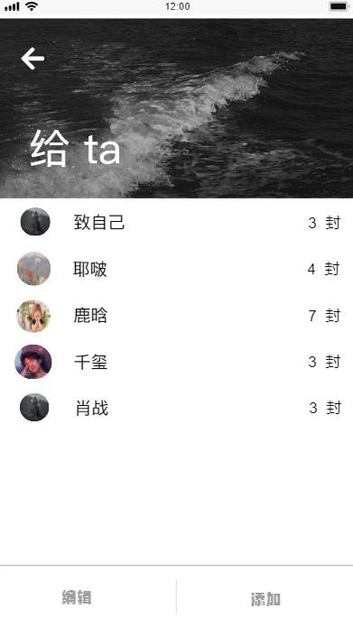
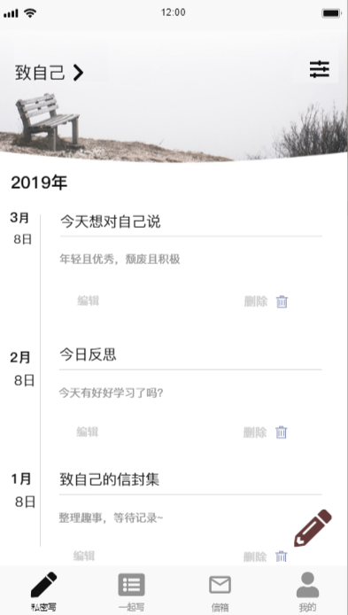
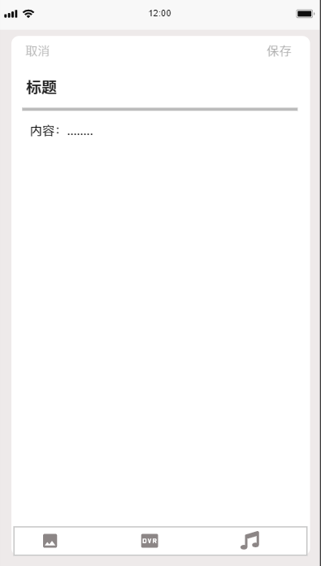

#### 一起写

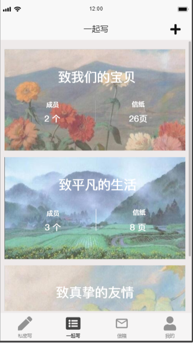
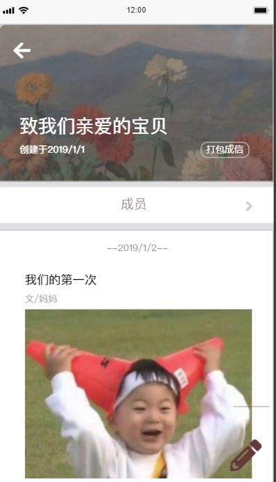

#### 收件箱

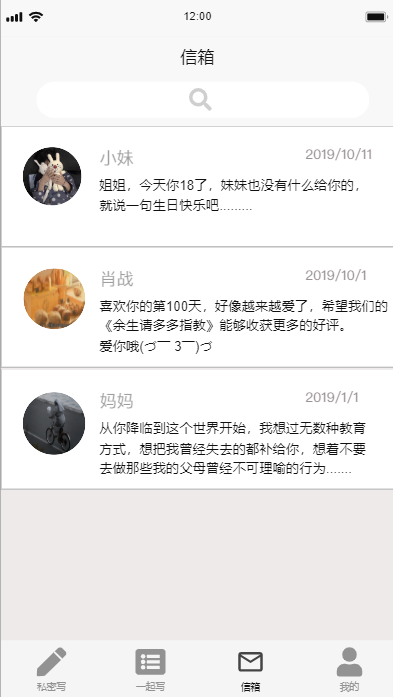
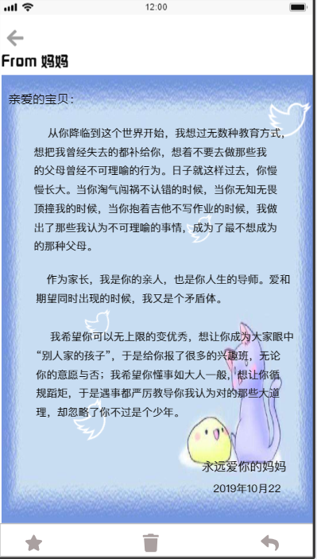

#### 我的

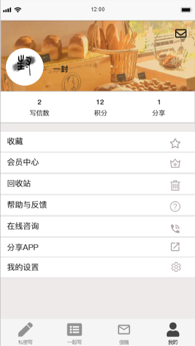

#### 设置

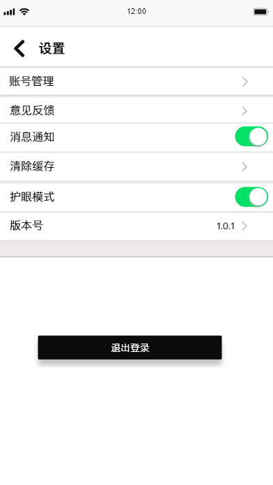

#### 登录/注册

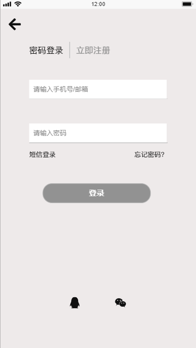

#### 通知页面

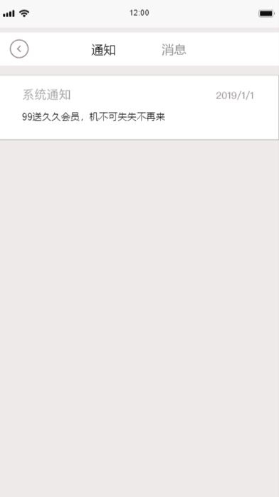

#### 消息页面

#### 后台

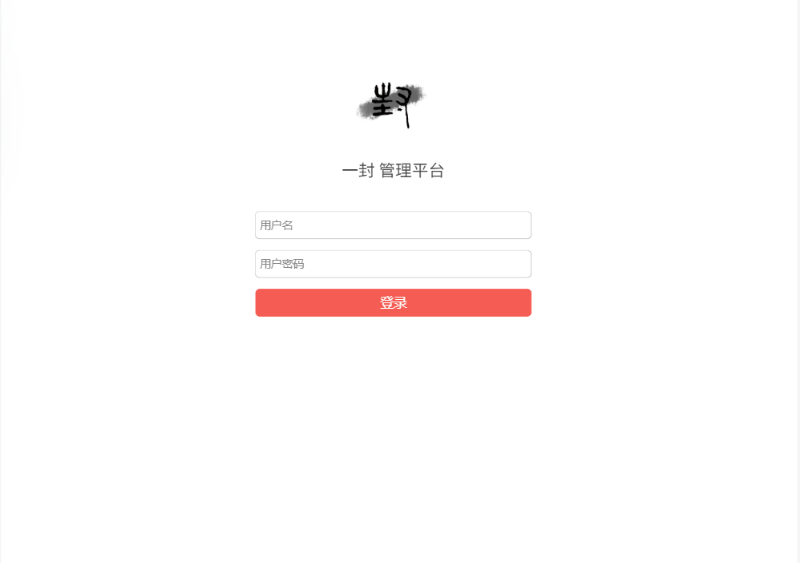
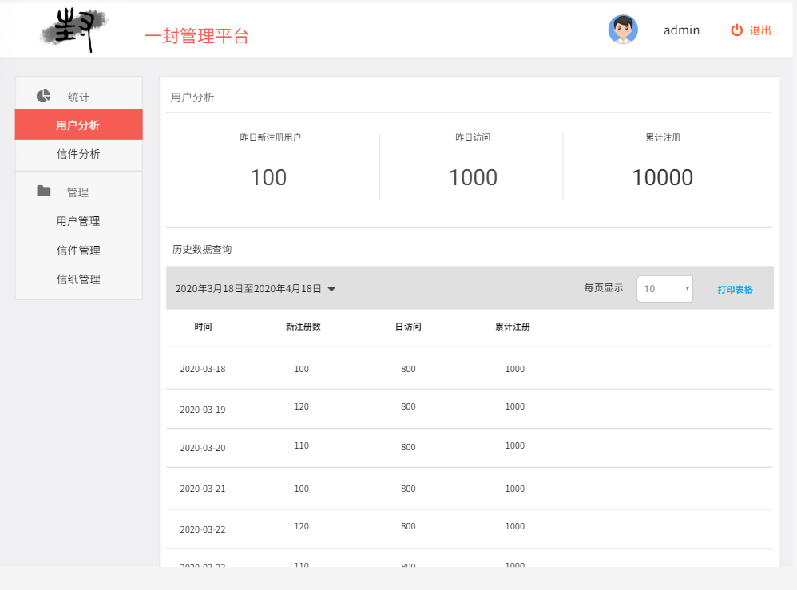
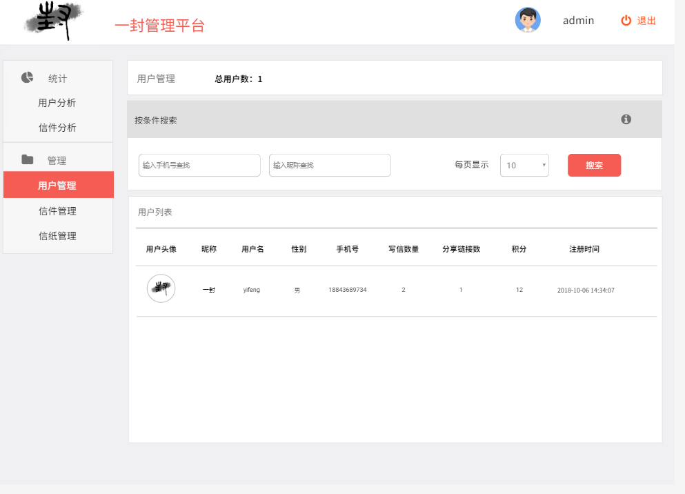
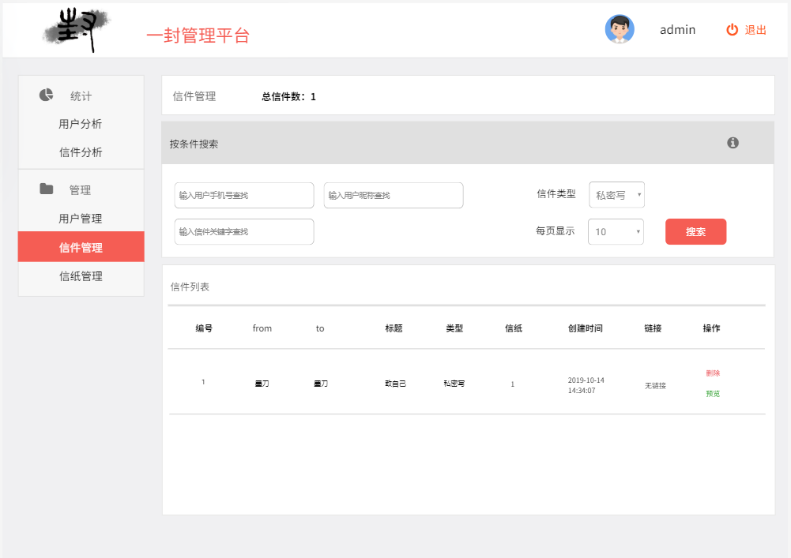
